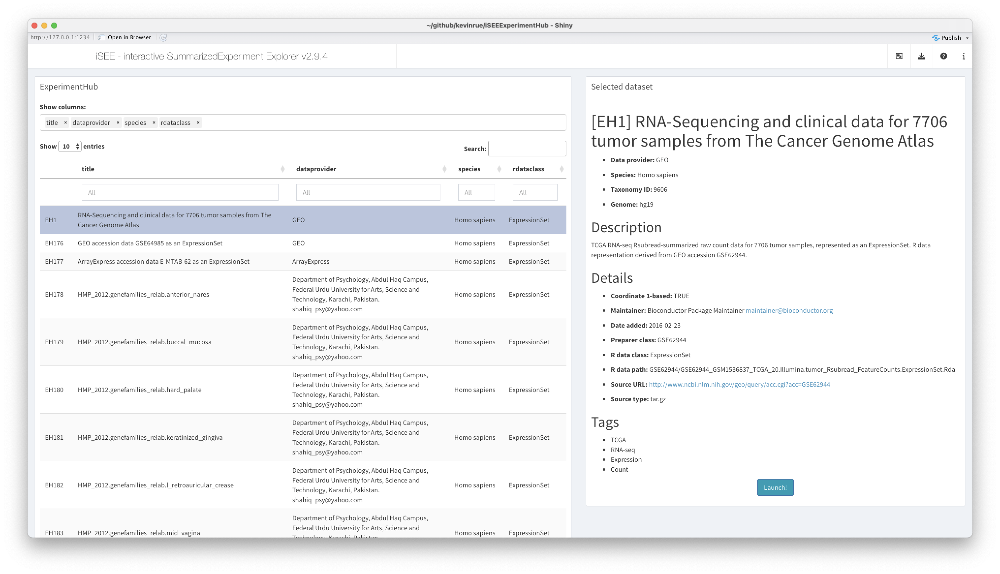

<!-- README.md is generated from README.Rmd. Please edit that file -->

```{r, include = FALSE}
knitr::opts_chunk$set(
    collapse = TRUE,
    comment = "#>",
    fig.path = "man/figures/README-",
    out.width = "100%"
)
```

# iSEEhub

<!-- badges: start -->
[](https://github.com/kevinrue/iSEEhub/issues)
[](https://github.com/kevinrue/iSEEhub/pulls)
[](https://lifecycle.r-lib.org/articles/stages.html#experimental)
[](https://github.com/kevinrue/iSEEhub/actions)
[](https://app.codecov.io/gh/kevinrue/iSEEhub?branch=main)
<!-- badges: end -->

The goal of `iSEEhub` is to provide an interface to the Bioconductor
`r BiocStyle::Biocpkg("ExperimentHub")` directly within an
`r BiocStyle::Biocpkg("iSEE")` web-application.

The main functionality of this package is to define a custom landing page
allowing users to browse the Bioconductor `r BiocStyle::Biocpkg("ExperimentHub")`
and directly load objects into an `r BiocStyle::Biocpkg("iSEE")` web-application.

## Installation instructions

Get the latest stable `R` release from [CRAN](http://cran.r-project.org/). Then install `iSEEhub` from [Bioconductor](http://bioconductor.org/) using the following code:

```{r 'install', eval = FALSE}
if (!requireNamespace("BiocManager", quietly = TRUE)) {
    install.packages("BiocManager")
}

BiocManager::install("iSEEhub")
```

And the development version from [GitHub](https://github.com/kevinrue/iSEEhub) with:

```{r 'install_dev', eval = FALSE}
BiocManager::install("kevinrue/iSEEhub")
```

## Example

This is a basic example which shows you how to solve a common problem:

```{r example, eval = requireNamespace('iSEEhub')}
library("iSEEhub")
library(ExperimentHub)
ehub <- ExperimentHub()

app <- iSEEhub(ehub)

if (interactive()) {
  shiny::runApp(app, port = 1234)
}
```



## Citation

Below is the citation output from using `citation('iSEEhub')` in R. Please
run this yourself to check for any updates on how to cite __iSEEhub__.

```{r 'citation', eval = requireNamespace('iSEEhub')}
print(citation('iSEEhub'), bibtex = TRUE)
```

Please note that the `iSEEhub` was only made possible thanks to many other R and bioinformatics software authors, which are cited either in the vignettes and/or the paper(s) describing this package.

## Code of Conduct

Please note that the `iSEEhub` project is released with a [Contributor Code of Conduct](http://bioconductor.org/about/code-of-conduct/). By contributing to this project, you agree to abide by its terms.

## Development tools

* Continuous code testing is possible thanks to [GitHub actions](https://www.tidyverse.org/blog/2020/04/usethis-1-6-0/)  through `r BiocStyle::CRANpkg('usethis')`, `r BiocStyle::CRANpkg('remotes')`, and `r BiocStyle::CRANpkg('rcmdcheck')` customized to use [Bioconductor's docker containers](https://www.bioconductor.org/help/docker/) and `r BiocStyle::Biocpkg('BiocCheck')`.
* Code coverage assessment is possible thanks to [codecov](https://codecov.io/gh) and `r BiocStyle::CRANpkg('covr')`.
* The [documentation website](http://kevinrue.github.io/iSEEhub) is automatically updated thanks to `r BiocStyle::CRANpkg('pkgdown')`.
* The code is styled automatically thanks to `r BiocStyle::CRANpkg('styler')`.
* The documentation is formatted thanks to `r BiocStyle::CRANpkg('devtools')` and `r BiocStyle::CRANpkg('roxygen2')`.

For more details, check the `dev` directory.

This package was developed using `r BiocStyle::Biocpkg('biocthis')`.

## Code of Conduct

Please note that the iSEEhub project is released with a [Contributor Code of Conduct](http://bioconductor.org/about/code-of-conduct/). By contributing to this project, you agree to abide by its terms.
