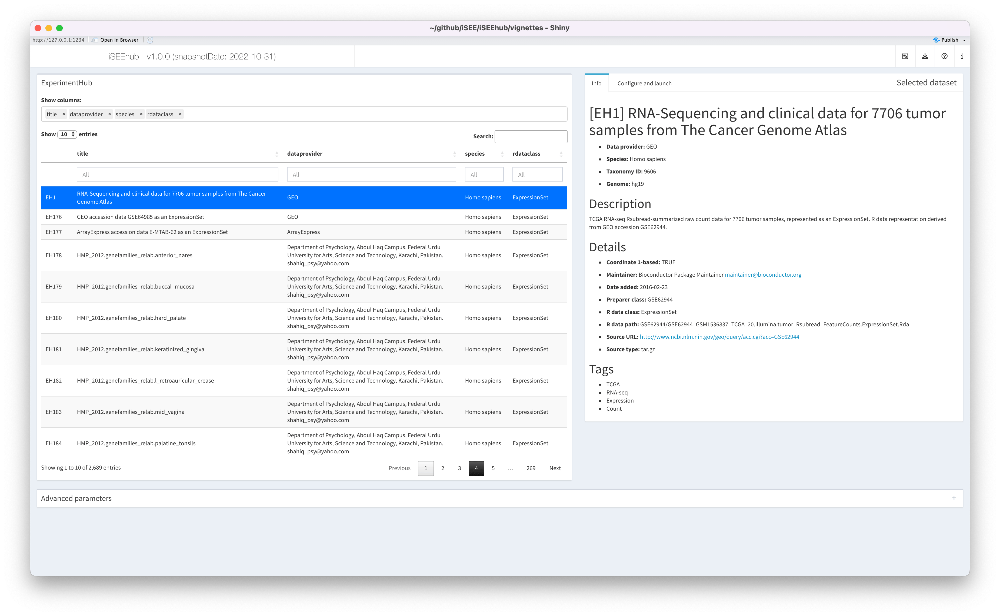

```{r setup, include = FALSE}
knitr::opts_chunk$set(
    collapse = TRUE,
    comment = "#>",
    crop = NULL ## Related to https://stat.ethz.ch/pipermail/bioc-devel/2020-April/016656.html
)
```


```{r vignetteSetup, echo=FALSE, message=FALSE, warning = FALSE}
## Track time spent on making the vignette
startTime <- Sys.time()

## Bib setup
library("RefManageR")

## Write bibliography information
bib <- c(
    R = citation(),
    BiocStyle = citation("BiocStyle")[1],
    knitr = citation("knitr")[1],
    RefManageR = citation("RefManageR")[1],
    rmarkdown = citation("rmarkdown")[1],
    sessioninfo = citation("sessioninfo")[1],
    testthat = citation("testthat")[1],
    iSEEhub = citation("iSEEhub")[1]
)
```


# Basics

## Install `iSEEhub`

_R_ is an open-source statistical environment which can be easily modified to enhance its functionality via packages. `r Biocpkg("iSEEhub")` is a _R_ package available via the [Bioconductor](http://bioconductor.org) repository for packages. _R_ can be installed on any operating system from [CRAN](https://cran.r-project.org/) after which you can install `r Biocpkg("iSEEhub")` by using the following commands in your _R_ session:

```{r "install", eval = FALSE}
if (!requireNamespace("BiocManager", quietly = TRUE)) {
      install.packages("BiocManager")
  }

BiocManager::install("iSEEhub")

## Check that you have a valid Bioconductor installation
BiocManager::valid()
```


## Required knowledge

`r Biocpkg("iSEEhub")` is based on many other packages that have implemented the infrastructure needed for dealing with omics data and interactive visualisation.
That is, packages like `r Biocpkg("SummarizedExperiment")`, `r Biocpkg("SingleCellExperiment")`, `r Biocpkg("iSEE")` and `r Biocpkg("shiny")`.

If you are asking yourself the question "Where do I start using Bioconductor?" you might be interested in [this blog post](http://lcolladotor.github.io/2014/10/16/startbioc/#.VkOKbq6rRuU).


## Asking for help

As package developers, we try to explain clearly how to use our packages and in which order to use the functions. But _R_ and _Bioconductor_ have a steep learning curve so it is critical to learn where to ask for help. The blog post quoted above mentions some but we would like to highlight the [Bioconductor support site](https://support.bioconductor.org/) as the main resource for getting help: remember to use the `iSEEhub` tag and check [the older posts](https://support.bioconductor.org/t/iSEEhub/). Other alternatives are available such as creating GitHub issues and tweeting. However, please note that if you want to receive help you should adhere to the [posting guidelines](http://www.bioconductor.org/help/support/posting-guide/). It is particularly critical that you provide a small reproducible example and your session information so package developers can track down the source of the error.

## Citing `iSEEhub`

We hope that `r Biocpkg("iSEEhub")` will be useful for your research. Please use the following information to cite the package and the overall approach. Thank you!

```{r "citation"}
## Citation info
citation("iSEEhub")
```

Here is an example of you can cite your package inside the vignette:

* `r Biocpkg("iSEEhub")` `r Citep(bib[["iSEEhub"]])`


# Quick start to using to `iSEEhub`

The main functionality of the package is available through the function `iSEEhub()`.

The function returns a `r Biocpkg("shiny")` app that can then be launched using the function `shiny::runApp()`.

```{r "start", message=FALSE}
library(iSEEhub)
library(ExperimentHub)
ehub <- ExperimentHub()

app <- iSEEhub(ehub)

if (interactive()) {
  shiny::runApp(app, port = 1234)
}
```




# The ExperimentHub pane

Datasets available in the _Bioconductor_ `r Biocpkg("ExperimentHub")` are listed -- along with metadata -- in the interactive table on the left.

The table may be filtered and sorted using any metadata column, to efficiently browse the datasets available.

By default, only a subset of metadata columns are displayed.
The selectize input labelled `Show columns:` at the top of the pane may be used to add, remove, or reorder columns in the table.

No more than one dataset may be selected at any time.


# The Selected Dataset pane

## Overview

The pane on the right updates with the currently selected dataset.

This pane contains information and the users inputs required to load the currently selected dataset in the main about the currently selected dataset in the main `r Biocpkg("iSEE")` app.

The pane is composed of two tabs described in the following sections.

## The Info tab

The `Info` tab displays the full metadata associated with the currently selected dataset -- the same metadata as in the `ExperimentHub` table -- in formatted text.

As such, users can uses a minimal subset of columns in the table to efficiently browse available datasets, while having a full overview of the currently selected dataset in this tab.

## The Config tab

The `Config` tab displays a selectize input offering users a choice of initial app configuration that are specific to the currently selected dataset.

For all datasets, an option `Default` is available.
That option does not provide any specific instruction with respect to the initial set of panels, their layout, nor their respective initial settings.
Instead, the `Default` option prompts the app to automatically identify all the built-in `r Biocpkg("iSEE")` panel classes that are compatible with the loaded dataset, initialising an app that contains one instance of each of those panels.

The number of panels and data points to draw for large datasets makes the `Default` option a showcase mode for demonstration and for new users, more than one optimised for a short loading time or featuring specific aspects of the dataset.

For some datasets, additional choices of initial settings are available.
Configurations are provided as scripts that define the list of panels and their respective initial configuration when the main `r Biocpkg("iSEE")` app is launched.

<!-- To contribute new scripts, please refer to the vignette [Contributing to iSEEhub](contributing.html). -->

For demonstration, a simple example `config_1.R` is included for the dataset `EH1`.
When selected, the contents of the configuration file are shown in the pane -- including any comment from the authors -- allowing users to review the script before using it.

When the apropriate configuration is selected, users may click the `Launch!` button to load the dataset into the main `r Biocpkg("iSEE")` app.


# The main iSEE app

Once the dataset is successfully loaded into the _R_ session, the app will switch to the main `r Biocpkg("iSEE")` view.


# Managing dataset dependencies

Each dataset in the Bioconductor `r Biocpkg("ExperimentHub")` is associated with package dependencies that are required to handle the dataset in an _R_ session.
Package dependencies must be installed in the _R_ library before the corresponding dataset can be loaded.

The list of packages associated with all datasets types supported by `r Biocpkg("iSEEhub")` is regularly updated in the `Suggests:` field of the `DESCRIPTION` file.
However, those packages are not automatically installed in a minimal installation of the `r Biocpkg("iSEEhub")` package.

By default, `iSEEhub(..., runtime_install = FALSE)` prevents the app from installing those dependencies at runtime.
In that case, when users identify a missing dependency, they must interrupt the app, install the required package(s) using the _R_ console, and re-launch the app.
We recommend this approach for applications hosted on public web-servers.


Alternatively, `iSEEhub(..., runtime_install = TRUE)` can be used to launch an app that prompts users interactively (i.e., within the app) for their consent to install missing dependencies.
We recommend this approach for applications run on personal computers (unless users prefer to install packages themselves, of course).


# Reproducibility

The `r Biocpkg("iSEEhub")` package `r Citep(bib[["iSEEhub"]])` was made possible thanks to:

* R `r Citep(bib[["R"]])`
* `r Biocpkg("BiocStyle")` `r Citep(bib[["BiocStyle"]])`
* `r CRANpkg("knitr")` `r Citep(bib[["knitr"]])`
* `r CRANpkg("RefManageR")` `r Citep(bib[["RefManageR"]])`
* `r CRANpkg("rmarkdown")` `r Citep(bib[["rmarkdown"]])`
* `r CRANpkg("sessioninfo")` `r Citep(bib[["sessioninfo"]])`
* `r CRANpkg("testthat")` `r Citep(bib[["testthat"]])`

This package was developed using `r BiocStyle::Biocpkg("biocthis")`.


Code for creating the vignette

```{r createVignette, eval=FALSE}
## Create the vignette
library("rmarkdown")
system.time(render("iSEEhub.Rmd", "BiocStyle::html_document"))

## Extract the R code
library("knitr")
knit("iSEEhub.Rmd", tangle = TRUE)
```

Date the vignette was generated.

```{r reproduce1, echo=FALSE}
## Date the vignette was generated
Sys.time()
```

Wallclock time spent generating the vignette.

```{r reproduce2, echo=FALSE}
## Processing time in seconds
totalTime <- diff(c(startTime, Sys.time()))
round(totalTime, digits = 3)
```

_R_ session information.

```{r reproduce3, echo=FALSE}
## Session info
library("sessioninfo")
options(width = 120)
session_info()
```


# Bibliography

This vignette was generated using `r Biocpkg("BiocStyle")` `r Citep(bib[["BiocStyle"]])`
with `r CRANpkg("knitr")` `r Citep(bib[["knitr"]])` and `r CRANpkg("rmarkdown")` `r Citep(bib[["rmarkdown"]])` running behind the scenes.

Citations made with `r CRANpkg("RefManageR")` `r Citep(bib[["RefManageR"]])`.

```{r vignetteBiblio, results = "asis", echo = FALSE, warning = FALSE, message = FALSE}
## Print bibliography
PrintBibliography(bib, .opts = list(hyperlink = "to.doc", style = "html"))
```
